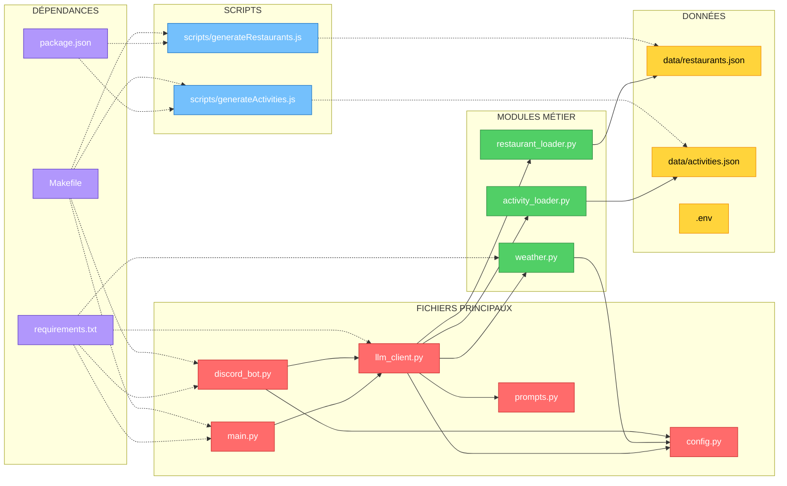

```mermaid
graph LR
    subgraph "FICHIERS PRINCIPAUX"
        Main["main.py"]
        Discord["discord_bot.py"]
        LLM["llm_client.py"]
        Config["config.py"]
        Prompts["prompts.py"]
    end

    subgraph "MODULES MÉTIER"
        Weather["weather.py"]
        Resto["restaurant_loader.py"]
        Activity["activity_loader.py"]
    end

    subgraph "DONNÉES"
        Restaurants["data/restaurants.json"]
        Activities["data/activities.json"]
        Env[".env"]
    end

    subgraph "SCRIPTS"
        GenR["scripts/generateRestaurants.js"]
        GenA["scripts/generateActivities.js"]
    end

    subgraph "DÉPENDANCES"
        Req["requirements.txt"]
        Pkg["package.json"]
        Make["Makefile"]
    end

    Main --> LLM
    Discord --> LLM
    LLM --> Config
    LLM --> Prompts
    LLM --> Weather
    LLM --> Resto
    LLM --> Activity
    
    Resto --> Restaurants
    Activity --> Activities
    Weather --> Config
    Discord --> Config
    
    GenR -.-> Restaurants
    GenA -.-> Activities
    
    Req -.-> Main
    Req -.-> LLM
    Req -.-> Weather
    Req -.-> Discord
    
    Pkg -.-> GenR
    Pkg -.-> GenA
    
    Make -.-> Main
    Make -.-> Discord
    Make -.-> GenR
    Make -.-> GenA

    classDef mainFile fill:#ff6b6b,stroke:#c92a2a,color:#fff
    classDef moduleFile fill:#51cf66,stroke:#2b8a3e,color:#fff
    classDef dataFile fill:#ffd43b,stroke:#f08c00,color:#000
    classDef scriptFile fill:#74c0fc,stroke:#1971c2,color:#fff
    classDef depFile fill:#b197fc,stroke:#5f3dc4,color:#fff

    class Main,Discord,LLM,Config,Prompts mainFile
    class Weather,Resto,Activity moduleFile
    class Restaurants,Activities,Env dataFile
    class GenR,GenA scriptFile
    class Req,Pkg,Make depFile
```